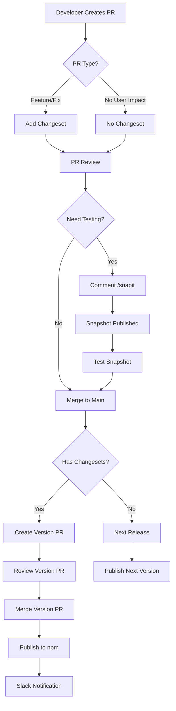

# Hydrogen Monorepo Release Process Overview

## Introduction
The Hydrogen monorepo uses a sophisticated release process built on GitHub Actions, Changesets, and npm workspaces. This document provides a comprehensive overview of how releases work, from development to publication.

## Repository Structure

### Packages Published to npm
- `@shopify/hydrogen` - Core Hydrogen framework
- `@shopify/cli-hydrogen` - CLI for Hydrogen development
- `@shopify/hydrogen-react` - React components and hooks
- `@shopify/hydrogen-codegen` - Code generation utilities
- `@shopify/create-hydrogen` - Project scaffolding tool
- `@shopify/mini-oxygen` - Local development server
- `@shopify/remix-oxygen` - Remix adapter for Oxygen

### Non-Published Packages
- Examples (`examples/*`) - Demonstration projects
- Templates (`templates/*`) - Project templates
- Documentation (`docs/*`) - Documentation sites

## Release Types

### 1. Main Releases (Production)
- **Workflow**: `changesets.yml`
- **Trigger**: Merging changeset PR to main
- **Tag**: `latest`
- **Process**:
  1. Developers add changesets during development
  2. Push to main creates "Version Packages" PR
  3. Merging PR publishes to npm
  4. Slack notification sent
  5. Templates compiled to dist branch

### 2. Next Releases (Pre-release)
- **Workflow**: `next-release.yml`
- **Trigger**: Every push to main (except release commits)
- **Tag**: `next`
- **Version Format**: `0.0.0-next-[SHA]-[timestamp]`
- **Purpose**: Immediate testing of latest changes

### 3. Snapshot Releases (PR Testing)
- **Workflow**: `snapit.yml`
- **Trigger**: `/snapit` comment on PR
- **Tag**: Unique snapshot tag
- **Version Format**: `[version]-snapshot-[PR]-[timestamp]`
- **Purpose**: Test PR changes before merge

### 4. Back-fix Releases (Patches)
- **Workflow**: `changesets-back-fix.yml`
- **Trigger**: Push to calver branches (e.g., `2025-01`)
- **Tag**: Branch name (e.g., `2025-01`)
- **Purpose**: Patch previous versions

## Release Flow Diagram



## Package Release Control

### Selective Package Release
The monorepo supports selective package releases through changesets:

1. **Individual Package Changes**:
   - Add changeset specifying only affected packages
   - Only specified packages get version bumps
   - Dependent packages updated according to `updateInternalDependencies` setting

2. **Multi-Package Changes**:
   - Single changeset can specify multiple packages
   - Each package gets appropriate version bump
   - Maintains version consistency

3. **Dependency Updates**:
   - Internal dependencies use `patch` updates by default
   - Ensures ecosystem compatibility

### Example: Releasing Only Hydrogen Core
```bash
# Create changeset for hydrogen only
npm run changeset add

# Select: @shopify/hydrogen
# Version: patch/minor/major
# Summary: "Fix rendering issue in Cart component"
```

This will:
- Only bump `@shopify/hydrogen` version
- Update packages that depend on it (if needed)
- Other packages remain at current versions

## CI/CD Integration

### Quality Gates (CI)
Before any release:
1. **Linting** - ESLint checks
2. **Formatting** - Prettier validation
3. **Type Checking** - TypeScript compilation
4. **Testing** - Unit test suite
5. **Recipe Validation** - Cookbook recipes

### Deployment Verification
- **Skeleton Deploy** - Validates base template
- **Examples Deploy** - Tests example applications
- **Oxygen Integration** - Ensures platform compatibility

## Release Coordination

### Branch Strategy
- `main` - Latest development, triggers next releases
- `2025-01`, etc. - Calendar version branches for patches
- `dist` - Compiled templates for distribution

### Commit Patterns
- `[ci] release` - Prevents next release trigger
- Regular commits - Trigger next releases
- Changeset commits - Track version changes

### Version Management
1. **Semantic Versioning**: All packages follow semver
2. **Calendar Versioning**: Back-fix branches use calver
3. **Coordinated Releases**: Related packages released together

## Security & Compliance

### npm Provenance
- All releases include provenance
- Links packages to source commits
- Enhances supply chain security

### Access Control
- Protected secrets for npm publishing
- Shopify GitHub token for elevated permissions
- CLA requirement for contributors

## Monitoring & Notifications

### Slack Integration
- Notifies on Hydrogen releases
- Includes version information
- Links to changelog

### GitHub Notifications
- PR comments for changesets
- Status checks for CI
- Release tags and GitHub releases

## Best Practices

### For Contributors
1. Always add changesets for user-facing changes
2. Use `/snapit` to test complex PRs
3. Follow semantic versioning guidelines
4. Include clear changeset descriptions

### For Maintainers
1. Review Version PRs carefully
2. Coordinate major releases
3. Monitor back-fix branches
4. Keep `latestBranch` updated in workflow

### For Package Consumers
1. Use `latest` tag for stable versions
2. Use `next` tag for bleeding edge
3. Specify exact versions in production
4. Monitor changelog for breaking changes

## Troubleshooting

### Common Issues
1. **Missing Changesets**: Use reminder workflow guidance
2. **Failed Releases**: Check npm token and permissions
3. **Version Conflicts**: Ensure clean changeset state
4. **Deployment Issues**: Verify Oxygen tokens

### Recovery Procedures
1. **Failed Publish**: Re-run workflow after fix
2. **Wrong Version**: Create patch release
3. **Broken Release**: Use back-fix workflow
4. **Missing Package**: Add to changeset config

## Summary
The Hydrogen release process provides:
- Automated version management
- Multiple release channels
- Selective package publishing
- Quality assurance integration
- Clear communication channels

This system enables rapid development while maintaining stability and allowing teams to test changes at various stages before production release.