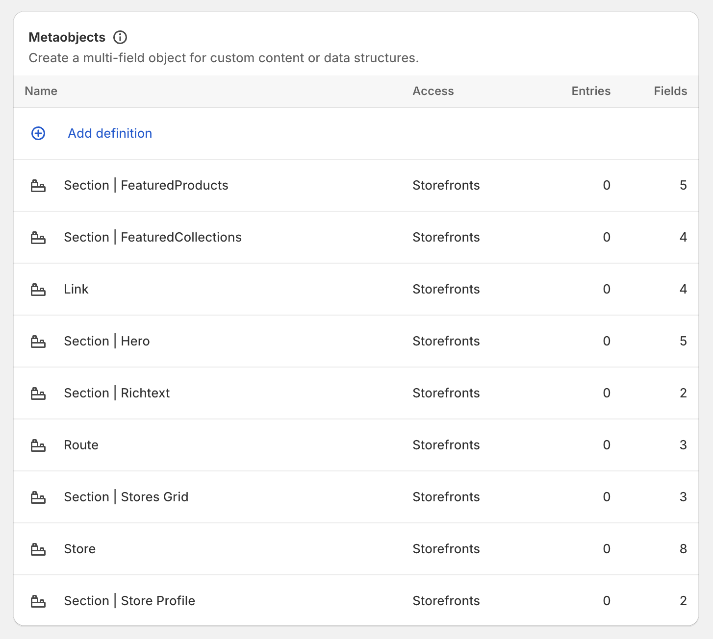
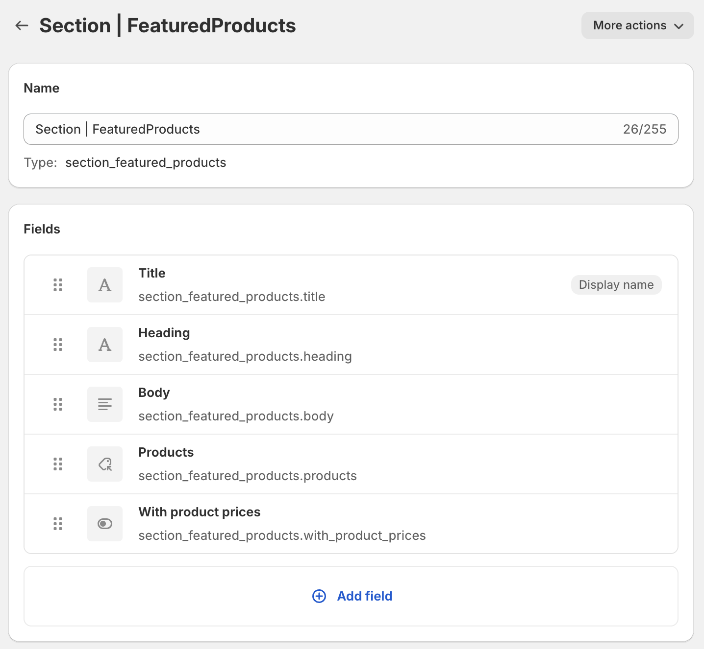
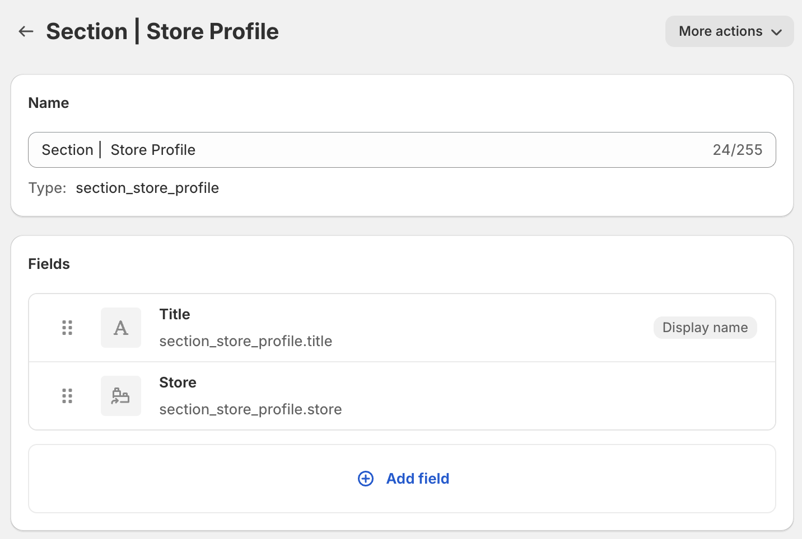

# Metaobjects Overview

The following document describes the high-level content management architecture and
metaobject definitions to create a basic content management system based on metaobjects.

## Content Architecture

```bash
Metaobject Definitions
┌─────────────────────────────────────────────────┐
│                                                 │
│   Route                                         │
│                                                 │
│   ┌─────────────────────────────────────────┐   │
│   │                                         │   │
│   │ Sections                                │   │
│   │                                         │   │
│   │ ┌─────────────────────────────────────┐ │   │
│   │ │ SectionHero                         │ │   │
│   │ ├─────────────────────────────────────┤ │   │
│   │ │ SectionFeaturedProducts             │ │   │
│   │ └─────────────────────────────────────┘ │   │
│   │  ...                                    │   │
│   │                                         │   │
│   └─────────────────────────────────────────┘   │
│                                                 │
└─────────────────────────────────────────────────┘
```

## Metaobject Definitions

The following is the list of metaojects that are created for this example:



### Route Definition

A route is a container metaobject that holds one or many `Section` entries that
you wish to render in a given Hydrogen route.

Route definition fields

)

### SectionHero Definition

This definition includes a basic set of fields to render a typical Hero section


### SectionFeaturedProducts Definition

This definition includes a basic set of fields to render a typical grid of products
that a merchant can curate via the admin.



### SectionFeaturedCollections Definition

This definition includes a basic set of fields to render a typical grid of collections
that a merchant can curate via the admin.


### Store Definition

This definition includes a basic set of fields to describe the basic structure of
a store branch.


### SectionStoreProfile Definition

This definition includes a reference field to associate a given store entry with
section entry.



### SectionStoreGrid Definition

This definition includes a stores field that allows the merchant to create a collection
of stores to display in grid.


## Structure of a Section component

Section components have a one-to-one relationship with Section metaobject definitions.

In other words, they are a react version of the definition that you will use to
render the section entry in the frontend.

### Overview

Define the section component

```ts
export function SectionExample(props: SectionExampleFragment) {}
```

Define the section's fragment that will be used for querying. The fragment should
include all the fields from the given definition in the admin.

```ts
const EXAMPLE_MEDIA_IMAGE_FRAGMENT = '#graphql
  fragment MediaImage on MediaImage {
    image {
      altText
      url
      width
      height
    }
  }
';

export const SECTION_HERO_FRAGMENT = '#graphql
  fragment SectionExample on Metaobject {
    type
    heading: field(key: "heading") {
      key
      value
    }
    subheading: field(key: "subheading") {
      key
      value
    }
    # other fields ...
  }
  ${EXAMPLE_MEDIA_IMAGE_FRAGMENT}
';
```

Pass the props to the `parseSection` to parse the metaobject fields and simplify
the resulting route content structure.

```ts
export function SectionExample(props: SectionExampleFragment) {
  const section = parseSection<
    SectionHeroFragment,
    {
      heading?: ParsedMetafields['single_line_text_field'];
      subheading?: ParsedMetafields['single_line_text_field'];
    }
  >(props);
}
```

Add the markup that defines the section

```ts
export function SectionExample(props: SectionExampleFragment) {
  const section = parseSection<
    SectionHeroFragment,
    {
      heading?: ParsedMetafields['single_line_text_field'];
      subheading?: ParsedMetafields['single_line_text_field'];
    }
  >(props);

  const {image, heading, subheading, link} = section;

  const backgroundImage = image?.image?.url
    ? `url("${image.image.url}")`
    : undefined;

  return (
    <section
      className="section-hero"
      style={{
        backgroundImage,
        height: '50%',
        backgroundPosition: 'center',
        backgroundRepeat: 'no-repeat',
        backgroundSize: 'cover',
        position: 'relative',
        minHeight: '500px',
      }}
    >
      <div
        style={{
          display: 'flex',
          flexDirection: 'column',
          justifyContent: 'center',
          paddingLeft: '2rem',
          position: 'absolute',
          top: 0,
          right: 0,
          left: 0,
          bottom: 0,
        }}
      >
        {heading && <h1 style={{marginBottom: 0}}>{heading.parsedValue}</h1>}
        {subheading && <p>{subheading.value}</p>}
      </div>
    </section>
  );
}
```
