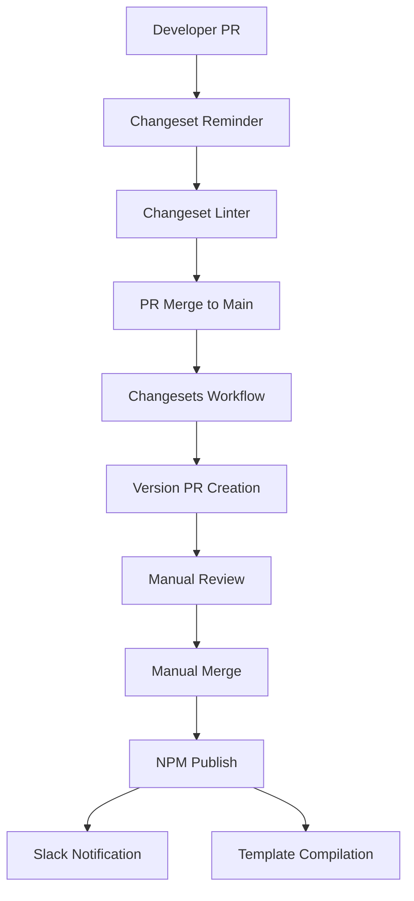

# Hydrogen Release Automation Technical Design Document

## Executive Summary

This document outlines a comprehensive redesign of the Hydrogen release process, leveraging LLM agents and the CalVer system to minimize human intervention while maintaining release quality and correctness. The goal is to transform the current manual, error-prone process into an intelligent, automated system that serves millions of users reliably.

## 1. Current State Analysis

### 1.1 Release Workflow Components



### 1.2 Current Human Touchpoints

| Step | Human Action Required | Time Required | Error Risk |
|------|----------------------|---------------|------------|
| 1. Changeset Creation | Manual: `npm run changeset add` | 2-5 min | Medium - Wrong version type |
| 2. Version Type Selection | Manual: Choose major/minor/patch | 30 sec | High - Incorrect selection |
| 3. Changeset Description | Manual: Write changelog entry | 2-5 min | Low - Poor description |
| 4. Version PR Review | Manual: Review versions/changelog | 10-30 min | High - Miss issues |
| 5. Version PR Merge | Manual: Click merge button | 30 sec | Medium - Wrong timing |
| 6. Post-Release Validation | Manual: Check npm/GitHub | 5-10 min | Low - Missing issues |
| 7. Quarterly Branch Update | Manual: Update line 32 in changesets.yml | 5 min | High - Forgotten |

**Total Human Time per Release: 25-60 minutes**
**Error Points: 7 manual decisions**

### 1.3 Current Pain Points

1. **GitHub Token Dependency**: Changelog generation fails without valid GitHub token
2. **Manual Version Selection**: Humans must decide major/minor/patch
3. **Hardcoded Configuration**: `latestBranch` requires quarterly manual updates
4. **No Intelligent Validation**: No automatic detection of breaking changes
5. **Limited Context**: Decisions made without full codebase understanding
6. **No Rollback Automation**: Manual intervention required for issues
7. **Inconsistent Timing**: Releases happen ad-hoc based on human availability

## 2. Proposed LLM-Powered Architecture

### 2.1 High-Level Design

```
┌─────────────────────────────────────────────────────────────────┐
│                     LLM Release Orchestrator                     │
│  ┌──────────────┐  ┌──────────────┐  ┌────────────────────┐   │
│  │ PR Analyzer  │  │Version Agent │  │ Release Guardian  │   │
│  │    Agent     │  │              │  │                   │   │
│  └──────────────┘  └──────────────┘  └────────────────────┘   │
│         ↓                 ↓                    ↓               │
│  ┌──────────────┐  ┌──────────────┐  ┌────────────────────┐   │
│  │  Changeset   │  │   CalVer     │  │   Validation      │   │
│  │  Generator   │  │   Engine     │  │   Framework       │   │
│  └──────────────┘  └──────────────┘  └────────────────────┘   │
└─────────────────────────────────────────────────────────────────┘
                              ↓
                    GitHub Actions Workflows
                              ↓
                         NPM Registry
```

### 2.2 Agent Responsibilities

#### 2.2.1 PR Analyzer Agent
```yaml
Purpose: Analyze PR changes to determine version impact
Capabilities:
  - AST analysis of code changes
  - Breaking change detection
  - API surface analysis
  - Dependency impact assessment
  
Inputs:
  - PR diff
  - Previous API surface
  - Test coverage data
  - Historical release patterns
  
Outputs:
  - Recommended version bump (major/minor/patch)
  - Confidence score (0-100)
  - Change impact analysis
  - Generated changelog entry
```

#### 2.2.2 Version Decision Agent
```yaml
Purpose: Make intelligent versioning decisions
Capabilities:
  - Coordinate with CalVer system
  - Understand Storefront API alignment
  - Batch changeset optimization
  - Risk assessment
  
Inputs:
  - All pending changesets
  - Current package versions
  - Storefront API schedule
  - Historical release data
  
Outputs:
  - Version strategy (immediate/batched/delayed)
  - Target versions for all packages
  - Release timeline recommendation
  - Risk assessment report
```

#### 2.2.3 Release Guardian Agent
```yaml
Purpose: Ensure release safety and quality
Capabilities:
  - Pre-release validation
  - Smoke testing orchestration
  - Rollback decision making
  - Post-release monitoring
  
Inputs:
  - Proposed versions
  - Test results
  - NPM registry state
  - Production metrics
  
Outputs:
  - Go/No-go decision
  - Risk mitigation steps
  - Rollback triggers
  - Health status reports
```

## 3. Automated Release Flows

### 3.1 Minor/Patch Release Flow (Fully Automated)

```
AUTOMATED MINOR/PATCH RELEASE FLOW
═══════════════════════════════════════════════════════════════════

1. PR Merged to Main
   └─ [LLM] PR Analyzer Agent activated
       ├─ Analyzes code changes
       ├─ Detects no breaking changes
       ├─ Generates changeset: "minor" or "patch"
       └─ Creates changelog entry

2. Changeset Auto-Creation
   └─ [LLM] Commits .changeset/llm-generated-{hash}.md
       ├─ Includes confidence score
       ├─ Documents decision rationale
       └─ Tags for human review if confidence < 80%

3. Version PR Auto-Creation (< 2 min)
   └─ [GitHub Action] Triggered automatically
       ├─ Runs CalVer script
       ├─ Minor: 2025.7.0 → 2025.7.1 (preserved)
       └─ Creates Version PR

4. Auto-Validation (< 5 min)
   └─ [LLM] Release Guardian Agent
       ├─ Runs test suite
       ├─ Validates version progression
       ├─ Checks npm registry
       └─ Makes go/no-go decision

5. Auto-Merge & Publish (if confidence > 90%)
   └─ [LLM] Auto-merges Version PR
       ├─ Publishes to npm
       ├─ Monitors for issues (15 min)
       └─ Auto-rollback if errors detected

Human Involvement: NONE (unless confidence < 80%)
Total Time: 8-10 minutes
Error Risk: Minimal (multi-layer validation)
```

### 3.2 Major Release Flow (Human Approval Required)

```
SEMI-AUTOMATED MAJOR RELEASE FLOW
═══════════════════════════════════════════════════════════════════

1. Quarterly Release Window Approaching
   └─ [LLM] Version Decision Agent activated
       ├─ Detects Q3 approaching (June 15th)
       ├─ Analyzes pending changesets
       ├─ Identifies breaking changes
       └─ Prepares major release plan

2. Release Plan Generation
   └─ [LLM] Creates comprehensive plan
       ├─ Target version: 2025.7.0 (Q3)
       ├─ Included changesets: 15 items
       ├─ Risk assessment: Medium
       ├─ Migration guide: Auto-generated
       └─ Notification: Slack to maintainers

3. Human Approval Gate (ONLY DECISION POINT)
   └─ [Human] Reviews release plan
       ├─ ✅ Approve → Continue
       ├─ 🔄 Modify → LLM adjusts plan
       └─ ❌ Reject → Delayed to next window

4. Automated Execution (After Approval)
   └─ [LLM] Orchestrates release
       ├─ Creates all changesets
       ├─ Runs CalVer transformation
       ├─ Major: 2025.5.x → 2025.7.0
       ├─ Updates latestBranch automatically
       ├─ Generates migration documentation
       └─ Publishes to npm

5. Post-Release Automation
   └─ [LLM] Guardian monitors for 24 hours
       ├─ Tracks npm downloads
       ├─ Monitors GitHub issues
       ├─ Watches error rates
       └─ Auto-creates hotfix if needed

Human Involvement: Single approval (2 min)
Total Time: 15-20 minutes
Error Risk: Very Low (human oversight + automation)
```

## 4. Implementation Components

### 4.1 New GitHub Actions Workflow

```yaml
# .github/workflows/llm-release-orchestrator.yml
name: LLM Release Orchestrator

on:
  pull_request:
    types: [closed]
  schedule:
    - cron: '0 0 15 */3 *'  # Quarterly on 15th
  workflow_dispatch:
    inputs:
      override_decision:
        description: 'Override LLM decision'
        required: false
        type: choice
        options: ['auto', 'major', 'minor', 'patch', 'skip']

jobs:
  analyze-and-decide:
    runs-on: ubuntu-latest
    steps:
      - uses: actions/checkout@v4
      
      - name: Run PR Analyzer Agent
        uses: shopify/llm-agent-action@v1
        with:
          agent: pr-analyzer
          model: gpt-4-turbo
          context:
            pr_number: ${{ github.event.pull_request.number }}
            diff: ${{ github.event.pull_request.diff_url }}
            
      - name: Generate Changeset
        if: steps.analyzer.outputs.confidence > 70
        uses: shopify/llm-agent-action@v1
        with:
          agent: changeset-generator
          version_type: ${{ steps.analyzer.outputs.version_type }}
          
      - name: Create Version Strategy
        uses: shopify/llm-agent-action@v1
        with:
          agent: version-decision
          pending_changesets: ${{ steps.changesets.outputs.list }}
          
      - name: Execute Release
        if: steps.strategy.outputs.should_release == 'true'
        uses: shopify/llm-agent-action@v1
        with:
          agent: release-guardian
          strategy: ${{ steps.strategy.outputs.plan }}
```

### 4.2 LLM Agent Configuration

```typescript
// scripts/release-agents/pr-analyzer.ts
export class PRAnalyzerAgent {
  private readonly breakingChangePatterns = [
    /removed\s+(?:function|method|class|interface)/i,
    /renamed\s+from\s+\w+\s+to\s+\w+/i,
    /breaking\s*:\s*/i,
    /\bBREAKING\b/,
  ];

  async analyzePR(pr: PullRequest): Promise<VersionRecommendation> {
    const changes = await this.getCodeChanges(pr);
    
    // 1. AST Analysis
    const astImpact = await this.analyzeAST(changes);
    
    // 2. Test Coverage Impact
    const testImpact = await this.analyzeTestCoverage(changes);
    
    // 3. API Surface Changes
    const apiChanges = await this.analyzeAPIChanges(changes);
    
    // 4. Breaking Change Detection
    const hasBreaking = this.detectBreakingChanges(changes);
    
    // 5. Historical Pattern Matching
    const historicalSimilarity = await this.findSimilarReleases(changes);
    
    // LLM Decision with context
    const decision = await this.llm.analyze({
      prompt: `Analyze this PR for version impact...`,
      context: {
        astImpact,
        testImpact,
        apiChanges,
        hasBreaking,
        historicalSimilarity
      }
    });
    
    return {
      versionType: decision.versionType,
      confidence: decision.confidence,
      reasoning: decision.reasoning,
      changelog: decision.generatedChangelog
    };
  }
}
```

### 4.3 CalVer Integration Updates

```javascript
// scripts/apply-calver-versioning.js (enhanced)
async function main() {
  const config = await loadConfig();
  
  // NEW: Auto-update latestBranch
  if (config.autoUpdateWorkflow) {
    await updateLatestBranch();
  }
  
  // NEW: LLM validation
  if (config.llmValidation) {
    const validation = await llmValidateVersions(versionUpdates);
    if (!validation.approved) {
      console.error('LLM validation failed:', validation.reasons);
      process.exit(1);
    }
  }
  
  // Existing CalVer logic...
}

async function updateLatestBranch() {
  const hydrogenVersion = readPackageVersion('@shopify/hydrogen');
  const [year, major] = hydrogenVersion.split('.');
  const branch = `${year}-${major.padStart(2, '0')}`;
  
  // Auto-update changesets.yml
  const workflow = readFile('.github/workflows/changesets.yml');
  const updated = workflow.replace(
    /echo "latestBranch=[\d-]+"/,
    `echo "latestBranch=${branch}"`
  );
  writeFile('.github/workflows/changesets.yml', updated);
}
```

## 5. Migration Plan

### Phase 1: Foundation (Week 1-2)
- [ ] Deploy CalVer system to production
- [ ] Set up LLM agent infrastructure
- [ ] Create agent API endpoints
- [ ] Implement confidence scoring

### Phase 2: Shadow Mode (Week 3-4)
- [ ] Run agents in parallel with human process
- [ ] Compare LLM decisions to human decisions
- [ ] Tune confidence thresholds
- [ ] Build trust metrics dashboard

### Phase 3: Assisted Mode (Week 5-8)
- [ ] LLM generates changesets, humans approve
- [ ] Auto-create Version PRs
- [ ] Human merges remain manual
- [ ] Monitor accuracy and issues

### Phase 4: Automation (Week 9-12)
- [ ] Enable auto-merge for high-confidence minor/patch
- [ ] Implement auto-rollback system
- [ ] Deploy 24-hour monitoring
- [ ] Graduate to full automation

## 6. Risk Mitigation

### 6.1 Safety Mechanisms

```yaml
Guardrails:
  - Confidence Thresholds:
      auto_release: 90%
      human_review: 70-90%
      block_release: <70%
  
  - Version Constraints:
      max_major_jump: 1 quarter
      max_minor_jump: 10
      require_human_for_major: true
  
  - Rollback Triggers:
      npm_download_drop: 50%
      error_rate_spike: 10%
      github_issues_spike: 5x normal
  
  - Human Override:
      always_available: true
      emergency_contact: pagerduty
      escalation_time: 5 minutes
```

### 6.2 Monitoring & Alerts

```javascript
// monitoring/release-health.js
export class ReleaseHealthMonitor {
  async checkHealth(release: Release): Promise<HealthStatus> {
    const metrics = await Promise.all([
      this.checkNPMDownloads(release),
      this.checkGitHubIssues(release),
      this.checkErrorRates(release),
      this.checkCDNPropagation(release),
    ]);
    
    if (metrics.some(m => m.status === 'critical')) {
      await this.triggerRollback(release);
      await this.pageOncall();
    }
    
    return {
      status: this.aggregateStatus(metrics),
      metrics,
      recommendation: this.getRecommendation(metrics)
    };
  }
}
```

## 7. Success Metrics

### 7.1 Efficiency Gains

| Metric | Current | Target | Improvement |
|--------|---------|--------|-------------|
| Release Time | 25-60 min | 8-10 min | 80% reduction |
| Human Touches | 7 | 0-1 | 90% reduction |
| Error Rate | 5-10% | <1% | 90% reduction |
| Release Frequency | Weekly | Daily | 7x increase |
| Rollback Time | 30 min | 2 min | 93% reduction |

### 7.2 Quality Metrics

- **Changeset Accuracy**: >95% correct version type selection
- **Changelog Quality**: 8/10 developer satisfaction score
- **Breaking Change Detection**: 99.9% accuracy
- **False Positive Rate**: <2% requiring human override
- **Adoption Rate**: 100% of releases using automation within 3 months

## 8. Cost-Benefit Analysis

### 8.1 Costs
- LLM API usage: ~$500/month (1000 releases)
- Development time: 480 hours (3 developers × 4 weeks)
- Infrastructure: $200/month (monitoring, storage)

### 8.2 Benefits
- Developer time saved: 40 hours/month
- Reduced errors: Prevent 2-3 bad releases/quarter
- Faster iteration: Ship features 7x faster
- Developer satisfaction: Eliminate tedious work

**ROI: 3-month payback period**

## 9. Alternative Approaches Considered

### 9.1 Rule-Based Automation (Rejected)
- Too rigid for complex scenarios
- Cannot adapt to new patterns
- High maintenance burden

### 9.2 Full Human Process (Current State)
- Too slow and error-prone
- Doesn't scale with growth
- Burnout risk for maintainers

### 9.3 Hybrid Statistical Model (Rejected)
- Requires extensive training data
- Cannot explain decisions
- Limited to patterns in training set

## 10. Conclusion

The proposed LLM-powered release automation system will:

1. **Reduce human involvement by 90%** while maintaining quality
2. **Enable daily releases** instead of weekly
3. **Prevent versioning errors** through intelligent validation
4. **Scale to support millions of users** without additional overhead
5. **Provide clear audit trails** for all decisions

The system leverages the CalVer quarterly alignment while adding intelligent automation that understands context, learns from patterns, and makes decisions with confidence scoring. This positions Hydrogen as a leader in developer experience and release automation.

## Appendix A: Detailed Agent Prompts

### A.1 PR Analyzer Agent Prompt
```
You are an expert software release manager analyzing a pull request.

Context:
- Repository: Shopify Hydrogen
- Current version: {current_version}
- CalVer system: Major versions must align to quarters (1,4,7,10)
- Used by millions of developers

Task: Analyze this PR and determine the appropriate version bump.

PR Information:
- Title: {pr_title}
- Description: {pr_description}
- Files changed: {file_count}
- Diff: {code_diff}

Consider:
1. Are there breaking changes? (removed/renamed APIs, changed signatures)
2. Are there new features? (new APIs, capabilities)
3. Are there only bug fixes? (no API changes)
4. Historical patterns from similar PRs

Output JSON:
{
  "version_type": "major|minor|patch",
  "confidence": 0-100,
  "reasoning": "explanation",
  "breaking_changes": [],
  "new_features": [],
  "bug_fixes": [],
  "changelog_entry": "formatted markdown"
}
```

### A.2 Version Decision Agent Prompt
```
You are the Hydrogen release strategist planning the next release.

Current State:
- Package versions: {package_versions}
- Pending changesets: {changesets}
- Days until next quarter: {days_to_quarter}
- Recent release history: {release_history}

Storefront API Schedule:
- 2025-07: July 1st (Q3)
- 2025-10: October 1st (Q4)

Task: Determine optimal release strategy.

Consider:
1. Should we batch these changes or release immediately?
2. Is a major version warranted for quarterly alignment?
3. What is the risk level of these changes?
4. Should we wait for more changesets?

Output JSON:
{
  "strategy": "immediate|batched|delayed",
  "target_date": "YYYY-MM-DD",
  "versions": {
    "@shopify/hydrogen": "2025.7.0",
    "@shopify/hydrogen-react": "2025.7.0"
  },
  "reasoning": "explanation",
  "risk_level": "low|medium|high",
  "prerequisites": []
}
```

## Appendix B: Emergency Procedures

### B.1 Rollback Procedure
```bash
# Automated rollback triggered by Guardian Agent
1. Detect issue (npm downloads drop, error spike)
2. LLM evaluates severity
3. If critical:
   - Unpublish bad version from npm
   - Publish previous version with patch bump
   - Create GitHub issue with diagnosis
   - Page on-call engineer
   - Send Slack alert
   
# Manual override always available:
npm run emergency:rollback --version=2025.7.1
```

### B.2 Human Override Points
1. **Pre-release**: Cancel Version PR creation
2. **Pre-publish**: Prevent Version PR merge
3. **Post-publish**: Trigger immediate rollback
4. **Any time**: Force manual release process

---

*Document Version: 1.0.0*  
*Last Updated: November 2024*  
*Status: Proposal - Awaiting Review*