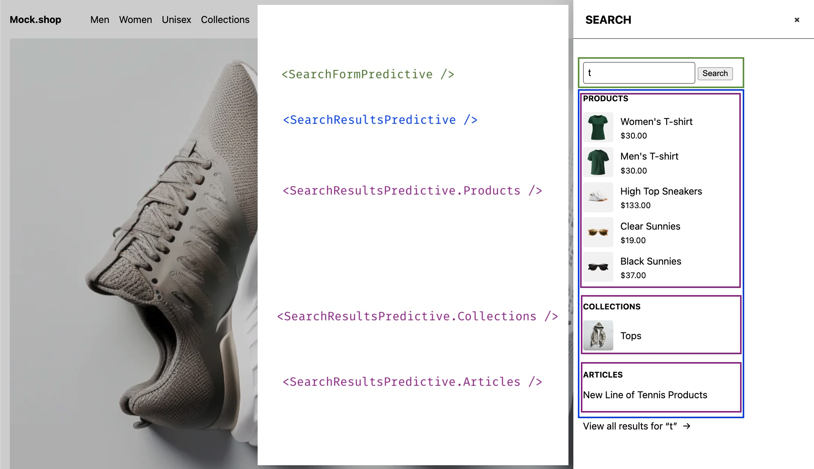

# Hydrogen Predictive Search

Our skeleton template ships with predictive search functionality. While [regular search](../search/search.md)
provides paginated search of `pages`, `articles` and `products` inside the `/search` route,
predictive provides real-time results in a aside drawer for `pages`, `articles`, `products`, `collections` and
recommended `queries/suggestions`.

This integration uses the storefront API (SFAPI) [predictiveSearch](https://shopify.dev/docs/api/storefront/latest/queries/vpredictiveSearch) endpoint to retrieve predictive search results based on a search term.

## Components Architecture



## Components

| File                                                                                             | Description                                                                                                                                            |
| ------------------------------------------------------------------------------------------------ | ------------------------------------------------------------------------------------------------------------------------------------------------------ |
| [`app/components/SearchFormPredictive.tsx`](../../app/components/SearchFormPredictive.tsx)       | A fully customizable form component configured to make form `GET` requests to the `/search` route.                                                    |
| [`app/components/SearchResultsPredictive.tsx`](../../app/components/SearchResultsPredictive.tsx) | A fully customizable search results wrapper, that provides compound components to render `articles`, `pages`, `products`, `collections` and `queries`. |

## Instructions

### 1. Create the search route

Create a new file at `/routes/search.tsx` (if not already created)

### 3. Add `predictiveSearch` query and fetcher

The predictiveSearch fetcher parses the `q` and `limit` formData properties sent
by the `<SearchFormPredictive />` component and performs the predictive search
SFAPI request.

```ts
/**
 * Predictive search query and fragments
 * (adjust as needed)
 */
const PREDICTIVE_SEARCH_ARTICLE_FRAGMENT = `#graphql
  fragment PredictiveArticle on Article {
    __typename
    id
    title
    handle
    blog {
      handle
    }
    image {
      url
      altText
      width
      height
    }
    trackingParameters
  }
` as const;

const PREDICTIVE_SEARCH_COLLECTION_FRAGMENT = `#graphql
  fragment PredictiveCollection on Collection {
    __typename
    id
    title
    handle
    image {
      url
      altText
      width
      height
    }
    trackingParameters
  }
` as const;

const PREDICTIVE_SEARCH_PAGE_FRAGMENT = `#graphql
  fragment PredictivePage on Page {
    __typename
    id
    title
    handle
    trackingParameters
  }
` as const;

const PREDICTIVE_SEARCH_PRODUCT_FRAGMENT = `#graphql
  fragment PredictiveProduct on Product {
    __typename
    id
    title
    handle
    trackingParameters
    selectedOrFirstAvailableVariant(
      selectedOptions: []
      ignoreUnknownOptions: true
      caseInsensitiveMatch: true
    ) {
      id
      image {
        url
        altText
        width
        height
      }
      price {
        amount
        currencyCode
      }
    }
  }
` as const;

const PREDICTIVE_SEARCH_QUERY_FRAGMENT = `#graphql
  fragment PredictiveQuery on SearchQuerySuggestion {
    __typename
    text
    styledText
    trackingParameters
  }
` as const;

// NOTE: https://shopify.dev/docs/api/storefront/latest/queries/predictiveSearch
const PREDICTIVE_SEARCH_QUERY = `#graphql
  query predictiveSearch(
    $country: CountryCode
    $language: LanguageCode
    $limit: Int!
    $limitScope: PredictiveSearchLimitScope!
    $term: String!
    $types: [PredictiveSearchType!]
  ) @inContext(country: $country, language: $language) {
    predictiveSearch(
      limit: $limit,
      limitScope: $limitScope,
      query: $term,
      types: $types,
    ) {
      articles {
        ...PredictiveArticle
      }
      collections {
        ...PredictiveCollection
      }
      pages {
        ...PredictivePage
      }
      products {
        ...PredictiveProduct
      }
      queries {
        ...PredictiveQuery
      }
    }
  }
  ${PREDICTIVE_SEARCH_ARTICLE_FRAGMENT}
  ${PREDICTIVE_SEARCH_COLLECTION_FRAGMENT}
  ${PREDICTIVE_SEARCH_PAGE_FRAGMENT}
  ${PREDICTIVE_SEARCH_PRODUCT_FRAGMENT}
  ${PREDICTIVE_SEARCH_QUERY_FRAGMENT}
` as const;

/**
 * Predictive search fetcher
 */
async function predictiveSearch({
  request,
  context,
}: Pick<ActionFunctionArgs, 'request' | 'context'>) {
  const {storefront} = context;
  const formData = await request.formData();
  const term = String(formData.get('q') || '');

  const limit = Number(formData.get('limit') || 10);

  // Predictively search articles, collections, pages, products, and queries (suggestions)
  const {predictiveSearch: items, errors} = await storefront.query(
    PREDICTIVE_SEARCH_QUERY,
    {
      variables: {
        // customize search options as needed
        limit,
        limitScope: 'EACH',
        term,
      },
    },
  );

  if (errors) {
    throw new Error(
      `Shopify API errors: ${errors.map(({message}) => message).join(', ')}`,
    );
  }

  if (!items) {
    throw new Error('No predictive search data returned');
  }

  const total = Object.values(items).reduce((acc, {length}) => acc + length, 0);

  return {term, result: {items, total}, error: null};
}
```

### 3. Add a `loader` export to the route

This action receives and processes `GET` requests from the `<SearchFormPredictive />`
component. These request include the search parameter `predictive` to identify them over
regular search requests.

A `q` URL parameter will be used as the search term and appended automatically by
the form if present in it's children prop.

```ts
/**
 * Handles predictive search GET requests
 * requested by the SearchFormPredictive component
 */
export async function loader({request, context}: LoaderFunctionArgs) {
  const url = new URL(request.url);
  const isPredictive = url.searchParams.has('predictive');

  if (!isPredictive) {
    return {}
  }

  const searchPromise = predictiveSearch({request, context})

  searchPromise.catch((error: Error) => {
    console.error(error);
    return {term: '', result: null, error: error.message};
  });

  return await searchPromise;
}
```

### 4. Render the predictive search form and results

Create a SearchAside or similar component to render the form and results.

```ts
import { SearchFormPredictive } from '~/components/SearchFormPredictive';
import { SearchResultsPredictive } from '~/components/SearchResultsPredictive';

function SearchAside() {
  return (
    <Aside type="search" heading="SEARCH">
      <div className="predictive-search">
        <br />
        <SearchFormPredictive>
          {({ fetchResults, goToSearch, inputRef }) => (
            <>
              <input
                name="q"
                onChange={fetchResults}
                onFocus={fetchResults}
                placeholder="Search"
                ref={inputRef}
                type="search"
              />
              &nbsp;
              <button onClick={goToSearch}>
                Search
              </button>
            </>
          )}
        </SearchFormPredictive>

        <SearchResultsPredictive>
          {({ items, total, term, state, inputRef, closeSearch }) => {
            const { articles, collections, pages, products, queries } = items;

            if (state === 'loading' && term.current) {
              return <div>Loading...</div>;
            }

            if (!total) {
              return <SearchResultsPredictive.Empty term={term} />;
            }

            return (
              <>
                <SearchResultsPredictive.Queries
                   queries={queries}
                   term={term}
                   inputRef={inputRef}
                />
                <SearchResultsPredictive.Products
                   products={products}
                   closeSearch={closeSearch}
                   term={term}
                />
                <SearchResultsPredictive.Collections
                   collections={collections}
                   closeSearch={closeSearch}
                   term={term}
                />
                <SearchResultsPredictive.Pages
                   pages={pages}
                   closeSearch={closeSearch}
                   term={term}
                />
                <SearchResultsPredictive.Articles
                   articles={articles}
                   closeSearch={closeSearch}
                   term={term}
                />
                {term.current && total && (
                  <Link onClick={closeSearch} to={`/search?q=${term.current}`}>
                    <p>
                      View all results for <q>{term.current}</q> →
                    </p>
                  </Link>
                )}
              </>
            );
          }}
        </SearchResultsPredictive>
      </div>
    </Aside>
  );
}
```

## Additional Notes

### How to use a different URL search parameter?

- Modify the `name` attribute in the forms input element. e.g

```ts
<input name="query" />`.
```

- Modify the fetchers term variable to parse the new name. e.g

```ts
const term = String(searchParams.get('query') || '');
```

### How to customize the way the results look?

Simply go to `/app/components/SearchResultsPredictive.tsx` and look for the compound
component you would like to modify.

Here we add images to each predictive product result item

```diff
SearchResultsPredictive.Products = function ({
  products,
  closeSearch,
  term,
}: SearchResultsPredictiveProductsProps) {
  if (!products.length) return null;

  return (
    <div className="predictive-search-result" key="products">
      <h5>Products</h5>
      <ul>
        {products.map((product) => {
          const productUrl = urlWithTrackingParams({
            baseUrl: `/products/${product.handle}`,
            trackingParams: product.trackingParameters,
            term: term.current,
          });
+         const price = product?.selectedOrFirstAvailableVariant?.price;
+         const image = product?.selectedOrFirstAvailableVariant?.image;
          return (
            <li className="predictive-search-result-item" key={product.id}>
              <Link to={productUrl} onClick={closeSearch}>
+               {image && (
+                 <Image
+                   alt={image.altText ?? ''}
+                   src={image.url}
+                   width={50}
+                   height={50}
+                 />
+               )}
                <div>
                  <p>{product.title}</p>
                  <small>
+                 {price && (
+                   <Money
+                     data={price}
+                   />
+                 )}
                  </small>
                </div>
              </Link>
            </li>
          );
        })}
      </ul>
    </div>
  )
};
```
