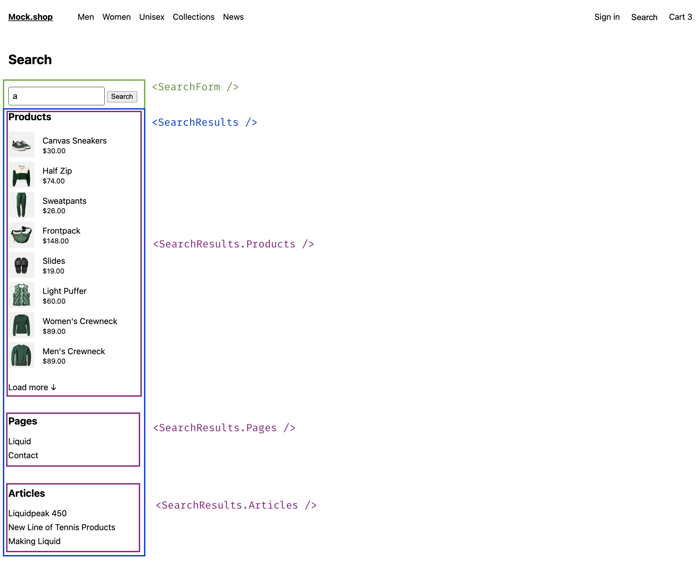

# Hydrogen Search

Our skeleton template ships with a `/search` route and a set of components to easily
implement a traditional search flow.

This integration uses the storefront API (SFAPI) [search](https://shopify.dev/docs/api/storefront/latest/queries/search)
endpoint to retrieve search results based on a search term.

## Components Architecture



## Components

| File                                                                                 | Description                                                                                                                 |
| ------------------------------------------------------------------------------------ | --------------------------------------------------------------------------------------------------------------------------- |
| [`app/components/SearchForm.tsx`](../../app/components/SearchForm.tsx)               | A fully customizable form component configured to make (server-side) form `GET` requests to the `/search` route.            |
| [`app/components/SearchResults.tsx`](../../app/components/SearchResults.tsx)         | A fully customizable search results wrapper, that provides compound components to render `articles`, `pages` and `products` |
| [`app/components/ProductSort.tsx`](../../app/components/ProductSort.tsx)       | A sort dropdown reused on both collection and search pages                                                                  |
| [`app/components/ProductFilters.tsx`](../../app/components/ProductFilters.tsx) | Product filters (list, swatch, and price range) reused on both collection and search pages                                  |

## Filtering and sorting

The search route supports product filtering and sorting via URL search parameters.
The same components and utilities power both the `/search` and `/collections/:handle`
routes.

### Sort

Sort options are controlled by the `sort_by` URL parameter. The search page supports
`RELEVANCE`, `PRICE_LOW_TO_HIGH`, and `PRICE_HIGH_TO_LOW`. Collection pages add
`FEATURED`, `BEST_SELLING`, `TITLE_A_TO_Z`, `TITLE_Z_TO_A`, `NEWEST`, and `OLDEST`.

Sort definitions live in [`app/lib/product-sort.ts`](../../app/lib/product-sort.ts).

### Filters

Filters use the Hydrogen JSON format: `filter.{graphqlKey}={JSON value}`.

For example:

- `?filter.variantOption={"name":"Color","value":"Red"}` — a single variant option
- `?filter.price={"min":25,"max":100}` — a price range
- Multiple values for the same key are supported (multi-select)

Filter parsing and URL helpers live in [`app/lib/product-filters.ts`](../../app/lib/product-filters.ts).

Available filters are determined by what the merchant has configured in the Shopify admin
under **Online Store → Navigation → Collection and search filters**. The Storefront API
returns the available filters in the `productFilters` field on the products connection.

## Instructions

### 1. Create the search route

Create a new file at `/routes/search.tsx`

### 2. Add `search` query and fetcher

The search fetcher parses the `q` parameter and performs the search SFAPI request.
It also parses filter and sort parameters from the URL and passes them to the query.

```ts
import {parseFiltersFromParams} from '~/lib/product-filters';
import {parseSortParam, SEARCH_SORT_OPTIONS} from '~/lib/product-sort';

/**
 * Regular search query and fragments
 * (adjust as needed)
 */
const SEARCH_PRODUCT_FRAGMENT = `#graphql
  fragment SearchProduct on Product {
    __typename
    handle
    id
    publishedAt
    title
    trackingParameters
    vendor
    selectedOrFirstAvailableVariant(
      selectedOptions: []
      ignoreUnknownOptions: true
      caseInsensitiveMatch: true
    ) {
      id
      image {
        url
        altText
        width
        height
      }
      price {
        amount
        currencyCode
      }
      compareAtPrice {
        amount
        currencyCode
      }
      selectedOptions {
        name
        value
      }
      product {
        handle
        title
      }
    }
  }
` as const;

const SEARCH_PAGE_FRAGMENT = `#graphql
  fragment SearchPage on Page {
     __typename
     handle
    id
    title
    trackingParameters
  }
` as const;

const SEARCH_ARTICLE_FRAGMENT = `#graphql
  fragment SearchArticle on Article {
    __typename
    handle
    id
    title
    trackingParameters
    blog {
      handle
    }
  }
` as const;

const PAGE_INFO_FRAGMENT = `#graphql
  fragment PageInfoFragment on PageInfo {
    hasNextPage
    hasPreviousPage
    startCursor
    endCursor
  }
` as const;

// NOTE: https://shopify.dev/docs/api/storefront/latest/queries/search
export const SEARCH_QUERY = `#graphql
  query RegularSearch(
    $country: CountryCode
    $endCursor: String
    $first: Int
    $language: LanguageCode
    $last: Int
    $term: String!
    $startCursor: String
    $productFilters: [ProductFilter!]
    $sortKey: SearchSortKeys
    $reverse: Boolean
  ) @inContext(country: $country, language: $language) {
    articles: search(
      query: $term,
      types: [ARTICLE],
      first: $first,
    ) {
      nodes {
        ...on Article {
          ...SearchArticle
        }
      }
    }
    pages: search(
      query: $term,
      types: [PAGE],
      first: $first,
    ) {
      nodes {
        ...on Page {
          ...SearchPage
        }
      }
    }
    products: search(
      after: $endCursor,
      before: $startCursor,
      first: $first,
      last: $last,
      query: $term,
      productFilters: $productFilters,
      sortKey: $sortKey,
      reverse: $reverse,
      types: [PRODUCT],
      unavailableProducts: HIDE,
    ) {
      nodes {
        ...on Product {
          ...SearchProduct
        }
      }
      productFilters {
        id
        label
        type
        values {
          id
          label
          count
          input
          swatch {
            color
            image {
              previewImage {
                url
              }
            }
          }
        }
      }
      pageInfo {
        ...PageInfoFragment
      }
    }
  }
  ${SEARCH_PRODUCT_FRAGMENT}
  ${SEARCH_PAGE_FRAGMENT}
  ${SEARCH_ARTICLE_FRAGMENT}
  ${PAGE_INFO_FRAGMENT}
` as const;

/**
 * Regular search fetcher
 */
async function regularSearch({request, context}) {
  const {storefront} = context;
  const url = new URL(request.url);
  const variables = getPaginationVariables(request, {pageBy: 8});
  const term = String(url.searchParams.get('q') || '');

  // Parse filters and sort from URL search params
  const filters = parseFiltersFromParams(url.searchParams);
  const sortOption = parseSortParam(url.searchParams, true);

  const {errors, ...items} = await storefront.query(SEARCH_QUERY, {
    variables: {
      ...variables,
      term,
      productFilters: filters.length > 0 ? filters : undefined,
      ...(sortOption && {
        sortKey: sortOption.sortKey,
        reverse: sortOption.reverse,
      }),
    },
  });

  if (!items) {
    throw new Error('No search data returned from Shopify API');
  }

  const total = Object.values(items).reduce(
    (acc, {nodes}) => acc + nodes.length,
    0,
  );

  const error = errors
    ? errors.map(({message}) => message).join(', ')
    : undefined;

  const productFilters = items.products?.productFilters ?? [];

  return {
    type: 'regular',
    term,
    error,
    result: {total, items, productFilters},
  };
}
```

### 3. Add a `loader` export to the route

This loader receives and processes `GET` requests from the `<SearchForm />` component.

A `q` URL parameter will be used as the search term and appended automatically by
the form if present in it's children prop

```ts
/**
 * Handles regular search GET requests
 * requested by the SearchForm component and /search route visits
 */
export async function loader({request, context}: Route.LoaderArgs) {
  const url = new URL(request.url);
  const isPredictive = url.searchParams.has('predictive');
  const searchPromise = isPredictive
    ? predictiveSearch({request, context})
    : regularSearch({request, context});

  searchPromise.catch((error: Error) => {
    console.error(error);
    return {term: '', result: null, error: error.message};
  });

  return await searchPromise;
}
```

### 4. Render the search form, filters, sort, and results

Finally, create a default export to render the search form, filter/sort controls,
and the search results.

```ts
import {SearchForm} from '~/components/SearchForm';
import {SearchResults} from '~/components/SearchResults';
import {ProductFilters} from '~/components/ProductFilters';
import {ProductSort} from '~/components/ProductSort';
import {SEARCH_SORT_OPTIONS} from '~/lib/product-sort';

/**
 * Renders the /search route
 */
export default function SearchPage() {
  const {type, term, result, error} = useLoaderData<typeof loader>();
  if (type === 'predictive') return null;

  return (
    <div className="search">
      <h1>Search</h1>
      <SearchForm>
        {({inputRef}) => (
          <>
            <input
              defaultValue={term}
              name="q"
              placeholder="Search…"
              ref={inputRef}
              type="search"
            />
            &nbsp;
            <button type="submit">Search</button>
          </>
        )}
      </SearchForm>
      {error && <p style={{color: 'red'}}>{error}</p>}
      {term && result?.total ? (
        <>
          <div className="product-controls">
            <ProductSort sortOptions={SEARCH_SORT_OPTIONS} />
          </div>
          {result?.productFilters && result.productFilters.length > 0 && (
            <ProductFilters filters={result.productFilters} />
          )}
        </>
      ) : null}
      {!term || !result?.total ? (
        <SearchResults.Empty />
      ) : (
        <SearchResults result={result} term={term}>
          {({articles, pages, products, term}) => (
            <div>
              <SearchResults.Products products={products} term={term} />
              <SearchResults.Pages pages={pages} term={term} />
              <SearchResults.Articles articles={articles} term={term} />
            </div>
          )}
        </SearchResults>
      )}
      <Analytics.SearchView data={{searchTerm: term, searchResults: result}} />
    </div>
  );
}
```

## Additional Notes

### How to use a different URL search parameter?

- Modify the `name` attribute in the forms input element. e.g

```ts
<input name="query" />`.
```

- Modify the search fetcher term variable to parse the new name. e.g

```ts
const term = String(searchParams.get('query') || '');
```

### How to customize the way the results look?

Simply go to `/app/components/SearchResults.tsx` and look for the compound component you
want to modify.

For example, let's render articles in a horizontal flex container

```diff
SearchResults.Pages = function({
  pages,
  term,
}: {
  pages: SearchItems['pages'];
  term: string;
}) {
  if (!pages?.nodes.length) {
    return null;
  }
  return (
    <div className="search-result">
      <h2>Pages</h2>
+     <div className="flex">
        {pages?.nodes?.map((page) => {
          const pageUrl = urlWithTrackingParams({
            baseUrl: `/pages/${page.handle}`,
            trackingParams: page.trackingParameters,
            term,
          });
          return (
            <div className="search-results-item" key={page.id}>
              <Link prefetch="intent" to={pageUrl}>
                {page.title}
              </Link>
            </div>
          );
        })}
      </div>
    </div>
  );
};
```

### How to customize filters?

The `ProductFilters` component renders all filter types returned by the Storefront API.
To show only specific filter types or rearrange them, modify the `.map()` inside
`ProductFilters.tsx`. For example, to hide price range filters:

```diff
  {filters.map((filter) => {
-   if (filter.type === 'PRICE_RANGE') {
-     // ... render PriceRangeFilter
-   }
+   if (filter.type === 'PRICE_RANGE') return null;

    if (filter.type !== 'LIST') return null;
    // ... render list filters
  })}
```

### How to add custom sort options?

Edit the `SEARCH_SORT_OPTIONS` or `COLLECTION_SORT_OPTIONS` objects in
`app/lib/product-sort.ts`. Each key maps to a Storefront API sort key and direction.
